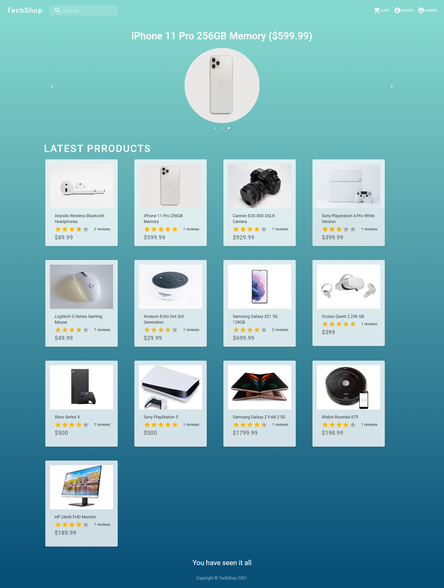

# TechShop
Hi!
TechShop is e-commerce website for people buy electronic products,

for live demo [click here](https://techshop-2021.herokuapp.com/)

sample user:
username - john@example.com
password - john147

## Built With

* [React](https://reactjs.org/)  - React is an open-source, front end, JavaScript library for building user interfaces or UI components.
* [Express](https://expressjs.com/) - Express.js, or simply Express, is a back end web application framework for Node.js.
* [MongoDB](https://www.mongodb.com/) - MongoDB is a source-available cross-platform document-oriented database program.
* [Redux](https://redux.js.org/) - Redux is an open-source JavaScript library for managing application state
* [Material-UI](https://material-ui.com/) - Material-UI is a simple and customizable component library to build faster, beautiful, and more accessible React applications. 
